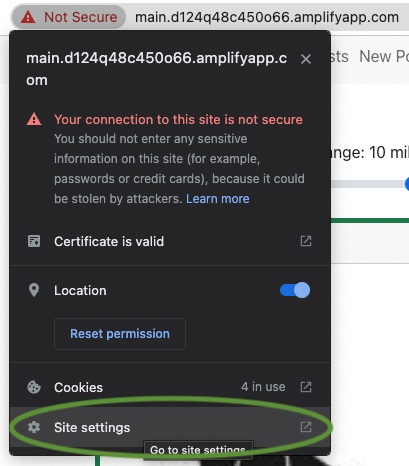

# Paw-Street

## Project Description:

Fluffy friends could be an important part in our life. Studies have shown that they can improve our physical and mental health. In the meantime, it's important to raise pets in a health way. And it could be heart-breaking if someone lost his pet.
Paw Street builds a community where pet lovers can post about everything related to their pets including stories and lost and found information. Users can see what's new around them and those lost pets and found pets. We believe that our application will help pet lovers share and gain information to lead a happy time with their pets.

## Instruction:

To view our application, you can simply click this [link](https://main.d124q48c450o66.amplifyapp.com/)(Please allow "Location" and "Insecure content" in site settings)



or run both frontend and backend on your device by following 5 steps below.(Database will be different but you don't need to sign up twice.)

1.Install MongoDB on your own computer.

2.Install Imagemagick on your own computer. ImageMagick download [here](https://imagemagick.org/script/download.php)

3.Install Redis on your own computer.

4.Please open a terminal in back-end folder and copy the commands below to run backend.

```
npm install
npm run seed
npm start
```

5.Please open a terminal in front-end folder and copy the commands below to run frontend.

```
npm install
npm start
```

## Group Members:

Lingrui Li 10478741

Jiyuan Xia 10468319

An Sun 10468679

## Course Technologies:

### 1.React

React is an open-source JavaScript front-end library. We will use React to develop single-page application. React component are reusable. By using that, application could be developed efficiently.

We use React to implement front-end of our project to generate single page application with components.

### 2.Redis

Redis is an in-memory key-value database. We can store data in RAM and reduce API calls.

Redis helps us to save time when we need to get some posts which are same as in RAM. When the back-end application receives GET request, it will query Redis first to get cached post. When the back-end application receives PATCH and DELETE comments requests, it will update cached post. When the back-end application receives DELETE post request, it will DELETE cached post as well.

### 3.Firebase Authentication

Firebase Auth provides back-end services. We will use firebase auth to manage users' authentication.

We implement sign up with email, sign in with email, sign in with google, sign out, reset password and change password with Firebase Authentication in our front-end application. In back-end, it receives access token from front-end requests and verifies them with the firebase-admin.

## Independent Technologies:

### 1.ImageMagick

ImageMagick is free software delivered as a ready-to-run binary distribution. We will use it to process pictures uploaded by users. For example, transform into a smaller size to the same space to make it easy to show as an icon on the map.

We re-size uploaded images to 128 \* 128 and re-format these images to .jpeg in order to save storage and manage them easier.

Please make sure ImageMagick has already install before running this project on local computer. ImageMagick download here: https://imagemagick.org/script/download.php

Check back-end/public/shrinkImage.js, make sure you require the fit version on gm.

### 2.AWS

We deploy the front-end react to AWS Amplify. It is a great platform that we can easily deploy react in production. We deploy the back-end application to AWS EC2 and use pm2 to manage it. EC2 is really a hard part for us, especially we have MongoDB, Redis and imageMagick running in backstage. Code runs perfect in my laptop but things are differdent in the cloud. Thanks my laptop for spoiling me and I will not throw it out of the window again when deploying the code, peace.

## Backend APIs

We implemented 9 backend APIs. You can find details [here.](https://documenter.getpostman.com/view/19990402/2s8YzWQfVy) GET requests are callable in Postman. POST, PATCH and DELETE requests need firebase token in the request header or body.
